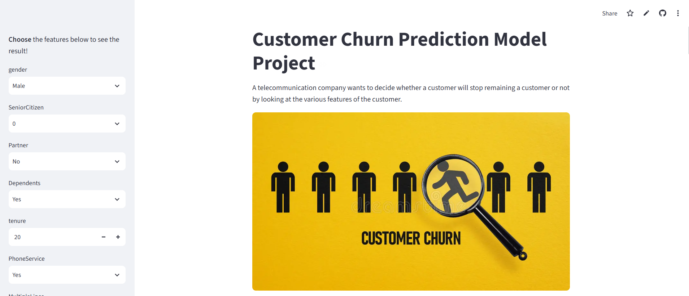

## 📊 Project Overview

A telecommunications company wants to identify customers likely to churn so it can act proactively 
with retention offers. This project builds an end-to-end churn prediction pipeline — from raw data 
to an interactive, explainable web app.

**Dataset:** [Kaggle Telco Customer Churn](https://www.kaggle.com/datasets/blastchar/telco-customer-churn) 
— 7,043 customers, 21 features (demographics, account info, subscribed services).

## 🧰 Tech Stack

`Python` · `DBeaver` (SQLite) · `pandas` / `NumPy` / `Matplotlib` · `scikit-learn` · `XGBoost` · `imbalanced-learn` 
· `SHAP` · `Streamlit`

## 🗂️ Data Pipeline

Raw CSV was imported into a SQLite database and managed through **DBeaver**, then queried into the 
notebook — simulating a more realistic setup than reading directly from a flat file.

## 🔍 Exploratory Data Analysis

After standard cleaning (missing `TotalCharges` values imputed as 0 for customers with 0 tenure), 
univariate and bivariate analyses were performed against the target variable. Key findings:

- Customers without a partner, without dependents, or on month-to-month contracts churn at 
  noticeably higher rates.
- **Fiber optic users churn significantly more**, despite being on a "premium" service. Digging 
  deeper: these customers also take up free add-ons (TechSupport, OnlineSecurity) at a much lower 
  rate than DSL users. Since low uptake of *free* services rules out a technical-support-driven 
  explanation, the churn is more likely **price-driven** than quality-driven.
- Electronic check payment method and high monthly charges are both associated with higher churn.

## 🛠️ Feature Engineering

A custom transformer (in `feature_engineering.py`) was built and wrapped in `FunctionTransformer` 
so it integrates directly into the sklearn pipeline:

- **`total_service`**: counts how many of the 9 services a customer subscribes to.

Standard preprocessing (One-Hot Encoding, Ordinal Encoding, Min-Max Scaling) was applied via 
`ColumnTransformer`.

## 🤖 Model Selection

Several baseline models were compared, then **XGBoost and Random Forest were tuned with 
`RandomizedSearchCV`** so every model got a fair, equally-optimized shot before comparison.

**Handling class imbalance (~73%/27% split)** was explored three ways:
1. **SMOTE** oversampling (via `imblearn.Pipeline`, to avoid leaking synthetic samples into 
   validation folds)
2. **`scale_pos_weight`** — computed dynamically per CV fold as the ratio of the business cost of 
   a missed churner (lost `MonthlyCharges`) to the cost of a wasted retention offer, using a custom 
   XGBoost predictor (needed since `RandomizedSearchCV` couldn't tune this parameter directly)
3. Both combined

A learning curve confirmed the validation score plateaus early, suggesting more data — or 
oversampling — has limited upside, which was later validated by the experiments above.

**Metric choice:** Models were compared with **F1 score** for consistency. In hindsight, an 
**F-beta score (β ≈ 2.45)** — weighting recall ~6x more than precision, matching the estimated 
false-negative/false-positive cost ratio — would better reflect the business objective. However, 
since `XGB_Weighted` was already optimized directly for that same cost ratio, comparing all models 
on F-beta at that stage would be biased in its favor. F1 was kept as the fairer, consistent 
selection criterion.

**`XGB_SMOTE`** was chosen as the final model. It performed on par with `RF_SMOTE` (F1 difference 
of ~0.002) but with substantially faster training and inference — a meaningful advantage for a 
model that may need frequent retraining or real-time scoring.

Threshold optimization on the precision-recall curve found a marginal (+0.2%) F1 improvement over 
the default 0.5 cutoff — not enough to justify moving away from the standard threshold.

## ✅ Final Evaluation

On the held-out test set, the final model achieved an **F1 score of 0.622** (precision 0.54, 
recall 0.74 for the churn class) — prioritizing catching churners over precision, consistent with 
the higher cost of false negatives.

## 🔬 Explainability (SHAP)

SHAP (`TreeExplainer`) was used for both local (per-prediction waterfall plots) and global 
(summary/bar plots) explainability. Globally, **`Contract`, `tenure`, `InternetService` (Fiber 
optic), and `MonthlyCharges`** emerged as the most influential features — consistent with the EDA 
findings.

## 🚀 Deployment

For inference, the SMOTE oversampling step was **removed from the final pipeline** (it's only 
needed during training, not prediction) before saving it for deployment. A Streamlit app wraps the 
pipeline with an interactive input form and displays both the prediction and its SHAP-based 
explanation.

## 🔗 Live Demo
[customer-churn-oguzhan.streamlit.app](https://customer-churn-oguzhan.streamlit.app/)

## 🔭 Limitations & Next Steps

- Re-tune models directly against F-beta score (rather than F1) for a selection criterion that's 
  fully aligned with the estimated business cost ratio.
- Explore a more systematic, business-driven threshold tuning instead of relying on the F1-optimal 
  cutoff.
- Estimated `fn_cost`/`fp_cost` values are approximations — validating them against real retention 
  campaign data would make the cost ratio (and therefore `scale_pos_weight`) more reliable.

